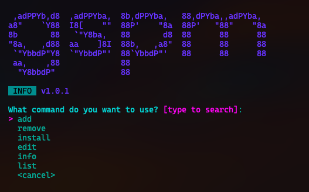

# gspm


Git Services Package Manager (GitHub, GitLab and Bitbucket).

Support installing from releases with custom script.

<p align="center">
  
</p>

## ✨ Features

-   Get asset from repository releases.
-   Run custom script to install, uncompress, move, etc.
-   Save repository/package info for future installs.
-   Interactive mode.
-   Multi-platform: Windows, Linux, MacOS.
-   Public and Private repositories

## ⬇️ Install

### Installing manually

Download manually from [releases](https://github.com/eduhds/gspm/releases).

<p>
  <a href="https://github.com/eduhds/gspm/releases/download/v1.0.1/gspm_v1.0.1_Windows_x86_64.zip"></a>
  <a href="https://github.com/eduhds/gspm/releases/download/v1.0.1/gspm_v1.0.1_Linux_x86_64.tar.gz"></a>
  <a href="https://github.com/eduhds/gspm/releases/download/v1.0.1/gspm_v1.0.1_Darwin_x86_64.tar.gz"></a>
</p>

### Install script

#### MacOS/Linux

```sh
curl -sL https://dub.sh/gspm.sh | bash
```

#### Windows

```powershell
powershell -c "irm https://dub.sh/gspm.ps1 | iex"
```

## 📖 Usage

### CLI

```sh
Usage: gspm [--configdir CONFIGDIR] [--shellcommand SHELLCOMMAND] [--githubtoken GITHUBTOKEN] [--gitlabtoken GITLABTOKEN] [--bitbuckettoken BITBUCKETTOKEN] [--script SCRIPT] [--service SERVICE] [COMMAND [REPOS [REPOS ...]]]

Positional arguments:
  COMMAND                Command to run. Must be add, remove, install, edit, info or list.
  REPOS                  Repos from Git Services (GitHub supported only for now). Format: username/repository

Options:
  --configdir CONFIGDIR [env: GSPM_CONFIG_DIR]
  --shellcommand SHELLCOMMAND [env: GSPM_SHELL_COMMAND]
  --githubtoken GITHUBTOKEN [env: GSPM_GITHUB_TOKEN]
  --gitlabtoken GITLABTOKEN [env: GSPM_GITLAB_TOKEN]
  --bitbuckettoken BITBUCKETTOKEN [env: GSPM_BITBUCKET_TOKEN]
  --script SCRIPT, -s SCRIPT
                         Script to run after download a asset. Use {{ASSET}} to reference the asset path.
  --service SERVICE      Git Service (github, gitlab, bitbucket) [default: github]
  --help, -h             display this help and exit
  --version              display version and exit
```

### Examples

```sh
# Add
gspm add username/repository
gspm add username/repository@tag
gspm add username/repository@latest

# Info, Edit
gspm info username/repository
gspm edit username/repository

# Using inline Script
gspm <add|edit> username/repository -s 'your script here'

# Remove (only from ~/.config/gspm.json)
gspm remove username/repository
# Remove (from ~/.config/gspm.json and running script to remove from system)
gspm remove username/repository -s 'your script here'

# List
gspm list

# Install (from ~/.config/gspm.json)
gspm install

# Service (default: github)
gspm <command> --service github
gspm <command> --service gitlab
gspm <command> --service bitbucket

# Custom config dir path
GSPM_CONFIG_DIR=/path/to/custom/dir gspm <command> ...

# Private repositories
GSPM_GITHUB_TOKEN='your token here' gspm add ...
GSPM_GITLAB_TOKEN='your token here' gspm add ...
GSPM_BITBUCKET_TOKEN='your token here' gspm add ...
```

## 🛠️ Development

```sh
# Run
go run . <command> <arguments>
```

## 🤝 Support

[](https://www.buymeacoffee.com/eduhds)
[](https://ko-fi.com/eduhds)

## 📜 License

[GPL-3.0 license](./LICENSE.txt)

## 🫂 Contributing

Contributions are welcome, see [Contributions Guide](./CONTRIBUTING.md) and [Code of Conduct](./CODE_OF_CONDUCT.md).

## 🙏 Credits/Thanks

-   [alexflint/go-arg](https://github.com/alexflint/go-arg)
-   [imroc/req](https://github.com/imroc/req)
-   [pterm/pterm](https://github.com/pterm/pterm)
-   [google/go-github](https://github.com/google/go-github)
-   [gitlab-org/api/client-go](https://gitlab.com/gitlab-org/api/client-go)
